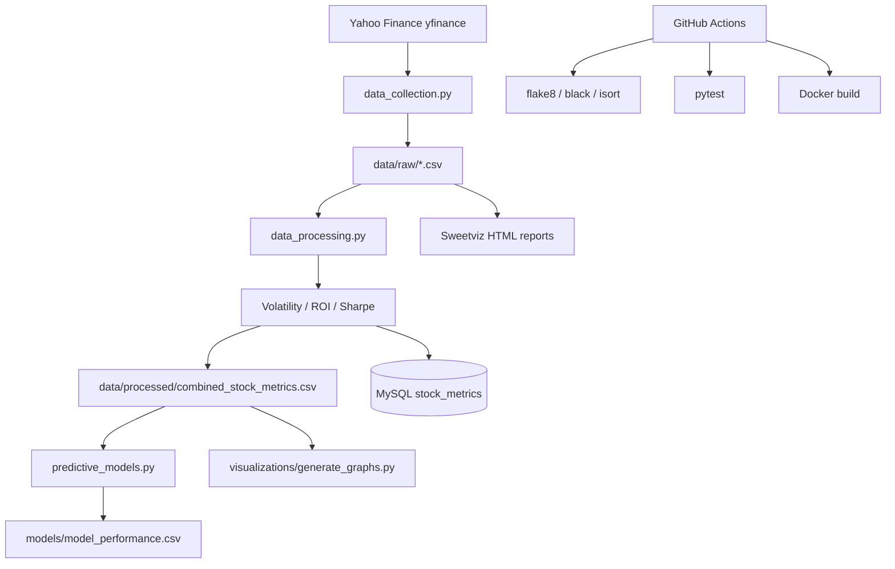

# Financial Risk Dashboard

### Equity risk pipeline for four mega-cap tickers — Yahoo Finance ingest, MySQL metrics, and ROI regression benchmarks

[](https://github.com/ArchanaChetan07/financial-risk-dashboard/actions/workflows/ci-cd.yml)
[](https://www.python.org/)
[](tests/test_dashboard.py)
[](#license)

End-to-end equity risk analytics for **AAPL**, **MSFT**, **GOOGL**, and **META**: pull one year of Yahoo Finance OHLCV, compute rolling volatility and Sharpe ratio, persist metrics to MySQL (optional), export processed CSVs, and benchmark eight scikit-learn regressors predicting ROI. Includes Sweetviz EDA HTML reports, matplotlib/seaborn charts, and GitHub Actions for lint, security scan, pytest, and Docker build.

---

## Key Results

| Metric | Value | Source |
|---|---|---|
| Tickers tracked | **4** (AAPL, MSFT, GOOGL, META) | `scripts/data_collection.py` |
| Combined processed rows | **1,008** (252 per ticker) | `data/processed/combined_stock_metrics.csv` |
| Derived metrics | Daily Return, 20-day Volatility, ROI, Sharpe Ratio | `scripts/data_processing.py` |
| Regression models compared | **8** (Linear, Ridge, Lasso, ElasticNet, RF, GBM, DT, SVR) | `scripts/predictive_models.py` |
| Best saved R² (Ridge) | **0.999998** (RMSE 2.24e-05) | `models/model_performance.csv` |
| MySQL tables | **4** (companies, categories, stock_categories, stock_metrics) | `sql/create_tables.sql` |
| Unit tests | **8** | `tests/test_dashboard.py` |
| CI workflows | **3** (ci-cd, pr-checks, retrain) | `.github/workflows/` |

---

## Architecture



**How it works:** `data_collection.py` fetches one year of history per ticker and generates Sweetviz EDA reports. `data_processing.py` computes rolling risk metrics, writes per-ticker CSVs plus a combined file, and optionally upserts rows into MySQL. `predictive_models.py` trains eight regressors on Close/Volume/returns features to predict ROI and saves ranked performance. `generate_graphs.py` produces price, volatility, Sharpe, and correlation charts.

---

## Tech Stack

| Layer | Choice |
|---|---|
| Language | Python 3.10 |
| Data | pandas, yfinance, Sweetviz |
| Database | MySQL (`mysql-connector-python`, SQLAlchemy) |
| ML | scikit-learn (8 regressors), StandardScaler, LabelEncoder |
| Viz | matplotlib, seaborn, scipy stats |
| Packaging | Docker (`infrastructure/Dockerfile`) |
| CI | GitHub Actions — lint, bandit, pip-audit, pytest, Docker build |

---

## Features

- Yahoo Finance ingest for four large-cap tech tickers with local CSV cache
- Rolling 20-day volatility and Sharpe ratio per trading day
- Optional MySQL persistence with company/category normalization
- Sweetviz HTML EDA reports per raw ticker file
- Eight-model ROI regression benchmark with saved CSV + bar chart
- High-resolution risk charts (price trends, return distributions, correlation heatmap)
- Mocked DB connection tests for offline CI

---

## Installation & Usage

```bash
git clone https://github.com/ArchanaChetan07/financial-risk-dashboard.git
cd financial-risk-dashboard
python -m venv .venv
# Windows: .venv\Scripts\activate
source .venv/bin/activate
pip install -r requirements.txt
```

```bash
# 1. Fetch Yahoo Finance data + EDA reports
cd scripts && python data_collection.py

# 2. Compute metrics (set DB_* env vars for MySQL, or CSV-only still works)
python data_processing.py

# 3. Train/evaluate regressors
python predictive_models.py

# 4. Generate charts
cd ../visualizations && python generate_graphs.py

# Tests
pytest tests/ -v
```

**MySQL setup:** run `sql/create_tables.sql`, then export `DB_HOST`, `DB_USER`, `DB_PASSWORD`, `DB_NAME`.

**Docker:**

```bash
docker build -f infrastructure/Dockerfile -t financial-risk-dashboard .
docker run --env-file .env financial-risk-dashboard
```

---

## Project Structure

```text
financial-risk-dashboard/
├── scripts/
│   ├── data_collection.py       # yfinance fetch + Sweetviz EDA
│   ├── data_processing.py       # metrics + MySQL upsert
│   └── predictive_models.py     # 8-model ROI regression
├── visualizations/
│   └── generate_graphs.py         # matplotlib/seaborn charts
├── data/
│   ├── raw/                       # per-ticker Yahoo CSVs
│   └── processed/                 # metrics + EDA HTML
├── models/
│   └── model_performance.csv      # saved R² / RMSE rankings
├── sql/create_tables.sql
├── tests/test_dashboard.py        # 8 pytest cases
├── infrastructure/Dockerfile
└── .github/workflows/             # ci-cd, pr-checks, retrain
```

---

## Future Improvements

- Add walk-forward validation to avoid ROI feature leakage in regression benchmarks
- Streamlit or static dashboard over `combined_stock_metrics.csv`
- Wire retrain workflow to scheduled model refresh on new Yahoo pulls
- Parameterize ticker list via config instead of hard-coded symbols

---

## License

See repository license file if present.
