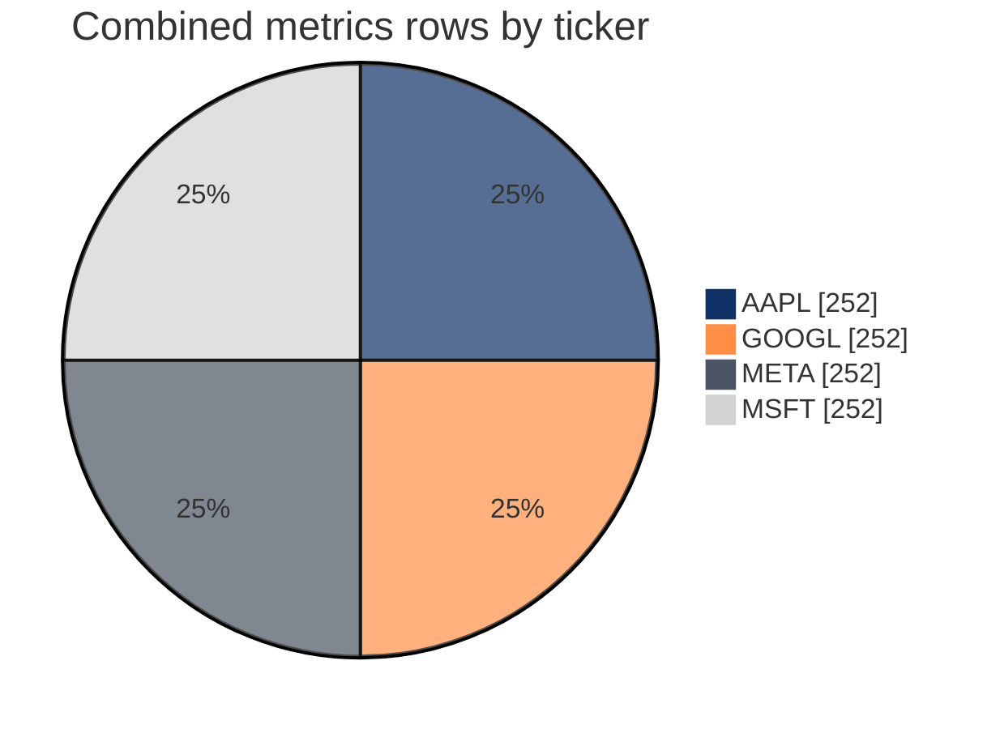
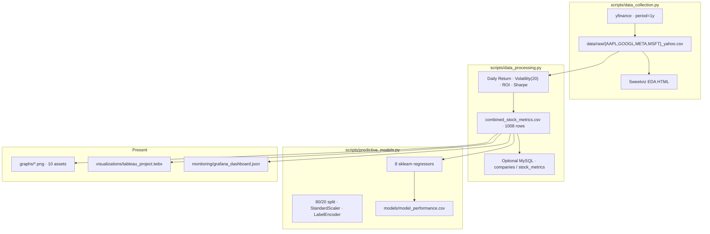
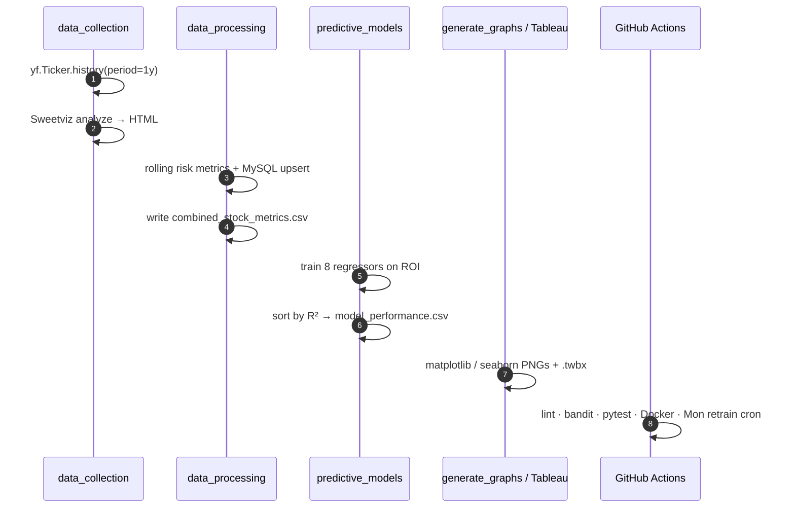

# Financial Risk Dashboard

### Yahoo Finance equity ETL → risk metrics → model baselines → Tableau / Grafana for AAPL, GOOGL, META, MSFT

[](https://github.com/ArchanaChetan07/financial-risk-dashboard/actions/workflows/ci-cd.yml)
[](requirements.txt)
[](scripts/data_collection.py)
[](visualizations/tableau_project.twbx)
[](infrastructure/Dockerfile)
[](sql/create_tables.sql)

> Repeatable path from **Yahoo Finance** downloads to **volatility / Sharpe / ROI** feature tables, **Sweetviz EDA**, **sklearn regressor baselines**, packaged **Tableau** workbook, **Grafana** JSON, and **CI + Monday retrain** workflows.

**Repo:** [github.com/ArchanaChetan07/financial-risk-dashboard](https://github.com/ArchanaChetan07/financial-risk-dashboard)

---

## Verified results (committed artifacts)

| Metric | Value | Source |
|---|---|---|
| Tickers | **AAPL, GOOGL, META, MSFT** | `data/raw/*_yahoo.csv` |
| Raw bars per ticker | **252** (~1y daily) | same |
| Raw date span (AAPL) | **2024-01-18 → 2025-01-17** | `data/raw/AAPL_yahoo.csv` |
| Combined feature rows | **1,008** (252 × 4) | `data/processed/combined_stock_metrics.csv` |
| Risk features | Daily Return · Volatility (20d) · ROI · Sharpe Ratio | `scripts/data_processing.py` |
| Regressors evaluated | **8** | `models/model_performance.csv` |
| Linear Regression R² | **1.0** · RMSE ≈ **1.86e-17** | `models/model_performance.csv` |
| Ridge Regression R² | **0.999998** · RMSE ≈ **2.24e-05** | same |
| Gradient Boosting R² | **0.997313** · RMSE ≈ **8.93e-04** | same |
| Random Forest R² | **0.995265** · RMSE ≈ **1.18e-03** | same |
| Decision Tree R² | **0.992014** | same |
| Lasso / ElasticNet R² | **−0.0226** | same |
| SVR R² | **−1.983** | same |
| Sweetviz EDA reports | **4** HTML | `data/processed/*_eda_report.html` |
| Graph PNGs | **10** | `graphs/` |
| Unit tests | **8** | `tests/test_dashboard.py` |
| CI workflows | **3** (`ci-cd`, `pr-checks`, `retrain`) | `.github/workflows/` |
| Tracked files | **51** | git tree |

```mermaid
xychart-beta
    title Committed R² by model (model_performance.csv)
    x-axis [Linear, Ridge, GradBoost, RandForest, DecTree, Lasso, ElasticNet, SVR]
    y-axis "R-Squared" -2 --> 1.1
    bar [1.0, 0.999998, 0.997313, 0.995265, 0.992014, -0.022555, -0.022555, -1.982834]
```



**Interpretability note:** In `data_processing.py`, `ROI` is defined as `(Close / Close.shift(1)) - 1`, which matches `Daily Return` (`pct_change`). The ROI-prediction task therefore includes a near-duplicate of the target among features — near-perfect linear R² is an **artifact of that design**, not out-of-sample predictive alpha. Numbers above are exactly what is checked into `model_performance.csv`.

---

## Architecture



### Pipeline sequence



### Feature engineering (code-faithful)

| Feature | Formula in `data_processing.py` |
|---|---|
| Daily Return | `Close.pct_change()` |
| Volatility | `Daily Return.rolling(20, min_periods=1).std()` |
| ROI | `(Close / Close.shift(1)) - 1` |
| Sharpe Ratio | `rolling_mean(20) / rolling_std(20)` of Daily Return |

Model features: `Close`, `Volume`, `Daily Return`, `Volatility`, `Sharpe Ratio`, `ticker` → target **`ROI`**.

---

## Model comparison (artifact)

| Rank | Model | R² | RMSE |
|---:|---|---:|---:|
| 1 | Linear Regression | 1.000000 | 1.86e-17 |
| 2 | Ridge Regression | 0.999998 | 2.24e-05 |
| 3 | Gradient Boosting Regressor | 0.997313 | 8.93e-04 |
| 4 | Random Forest Regressor | 0.995265 | 1.18e-03 |
| 5 | Decision Tree Regressor | 0.992014 | 1.54e-03 |
| 6 | Lasso Regression | −0.022555 | 0.0174 |
| 7 | ElasticNet Regression | −0.022555 | 0.0174 |
| 8 | Support Vector Regressor (SVR) | −1.982834 | 0.0297 |

---

## Data & visuals

| Layer | Contents |
|---|---|
| Raw | 4 CSVs · OHLCV + dividends/splits · 252 rows each |
| Processed | Per-ticker metrics CSVs + **combined** 1,008-row table + 4 Sweetviz HTML reports |
| Graphs | Closing trends · returns distributions · volatility · Sharpe · correlation · sector metrics · **R² comparison** |
| BI | `visualizations/tableau_project.twbx` |
| Ops | `monitoring/grafana_dashboard.json` |
| Schema | `sql/create_tables.sql` — `companies`, `categories`, `stock_categories`, `stock_metrics` |

---

## CI / CD & containers

| Workflow | Trigger | Role |
|---|---|---|
| `ci-cd.yml` | push / PR | black · isort · flake8 · bandit · pip-audit · pytest · Docker build |
| `pr-checks.yml` | pull requests | PR gate checks |
| `retrain.yml` | cron `0 2 * * 1` + `workflow_dispatch` | collect → process → retrain models |

```text
infrastructure/Dockerfile          # python:3.10-slim · MariaDB client · non-root appuser
financial-risk-dashboard-cicd/…    # mirrored Dockerfile + CICD_SETUP docs
```

---

## Repository layout

```text
financial-risk-dashboard/          ← 51 tracked files
├── scripts/
│   ├── data_collection.py         # yfinance + Sweetviz
│   ├── data_processing.py         # risk metrics + MySQL
│   └── predictive_models.py       # 8 regressors → CSV + R² chart
├── data/raw/ · data/processed/
├── models/model_performance.csv
├── graphs/                        # 10 PNGs
├── visualizations/                # generate_graphs.py · tableau_project.twbx
├── sql/create_tables.sql
├── monitoring/grafana_dashboard.json
├── infrastructure/Dockerfile
├── tests/test_dashboard.py        # 8 pytest cases
└── .github/workflows/             # ci-cd · pr-checks · retrain
```

---

## Quick start

```bash
git clone https://github.com/ArchanaChetan07/financial-risk-dashboard.git
cd financial-risk-dashboard

python -m venv .venv
# Windows: .\.venv\Scripts\Activate.ps1
source .venv/bin/activate

pip install -r requirements.txt

# Optional MySQL (data_processing): set DB_HOST, DB_USER, DB_PASSWORD, DB_NAME
python scripts/data_collection.py
python scripts/data_processing.py
python scripts/predictive_models.py
python visualizations/generate_graphs.py

pytest tests/ -v
```

Docker:

```bash
docker build -f infrastructure/Dockerfile -t financial-risk-dashboard .
```

Open `visualizations/tableau_project.twbx` in Tableau, or import `monitoring/grafana_dashboard.json` into Grafana.

---

## Skills surface

`Python` · `yfinance` · `pandas` · `Sweetviz` · `sklearn` · `matplotlib` · `seaborn` · `MySQL` · `SQLAlchemy` · `Tableau` · `Grafana` · `Docker` · `GitHub Actions` · `pytest` · `bandit` · `ETL` · `risk metrics` · `Sharpe / volatility` · `model comparison` · `scheduled retrain`

---

## Roadmap

- Replace ROI target with a forward return (or drop Daily Return from features) so R² reflects genuine forecast skill  
- Pin NumPy/pandas versions for reproducible local installs  
- Streamlit / FastAPI interactive risk view over the combined metrics table  

---

## Author

**Archana Chetan** · [@ArchanaChetan07](https://github.com/ArchanaChetan07)

Portfolio project demonstrating **financial data engineering + risk analytics + baseline ML + BI packaging + CI/CD**, with metrics traced to committed CSVs — never invented scores.

---

## License

See repository.
