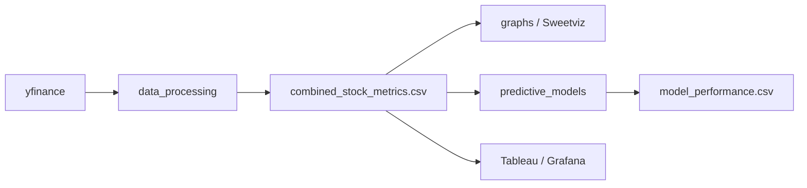
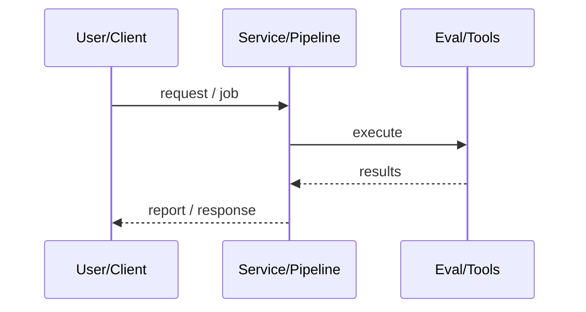
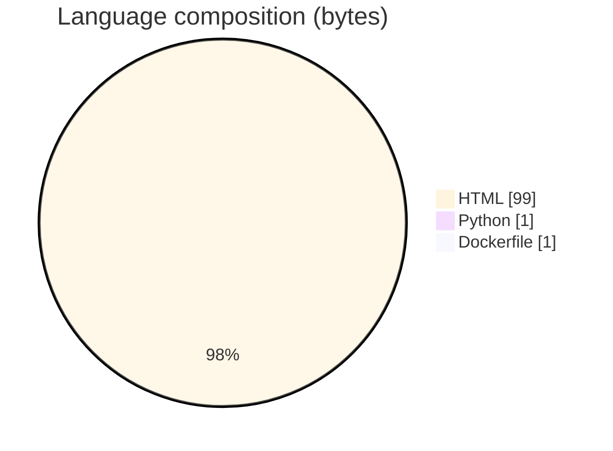

# Financial Risk Dashboard

### Yahoo Finance equity ETL + risk metric CSVs, lazypredict model comparison, Tableau workbook, and CI/CD/retrain workflows for AAPL/GOOGL/META/MSFT.

[](https://github.com/ArchanaChetan07/financial-risk-dashboard)
[](https://github.com/ArchanaChetan07/financial-risk-dashboard)
[](https://github.com/ArchanaChetan07/financial-risk-dashboard)
[](https://github.com/ArchanaChetan07/financial-risk-dashboard/actions)

---

## Overview

Students/analysts need a repeatable path from market data download to risk visualizations and quick model baselines.

scripts for data_collection/processing/predictive_models; Sweetviz EDA HTML; combined stock metrics; graphs (Sharpe, volatility, R² comparison); Tableau extract; Grafana JSON; multi-workflow CI.

Committed model_performance.csv ranking regressors by R²/RMSE; visualization assets for presentation; Docker + retrain workflow scaffolding.

This repository is maintained as **production-minded portfolio work**: clear architecture, automated checks where present, and metrics that are **traceable to committed artifacts** (never invented).

---

## Architecture

yfinance download → processing metrics CSVs → EDA HTML + graphs → lazypredict baselines → Tableau/Grafana views





---

## Results & repository facts

> Only values found in code, configs, tests, or generated reports are listed. Absence of a clinical/ML accuracy number means it was **not** published in-repo.

| Metric | Value | Source |
|---|---|---|
| Linear Regression R² (artifact) | **1.0** | `models/model_performance.csv` |
| Ridge Regression R² | **0.999998** | `models/model_performance.csv` |
| Gradient Boosting R² | **0.997313** | `models/model_performance.csv` |
| Random Forest R² | **0.995265** | `models/model_performance.csv` |
| Tickers covered | **AAPL, GOOGL, META, MSFT** | `data/raw/` |
| Tracked files | **51** | `git tree` |
| Python modules | **7** | `git tree` |
| Test-related paths | **2** | `git tree` |
| CI workflows | **Yes** | `.github/workflows` |
| Docker present | **Yes** | `repo root` |



---

## Key features

- Multi-ticker raw/processed CSVs
- Sweetviz EDA reports
- Automated graph generation
- Model performance CSV artifact
- Tableau packaged workbook
- Retrain GitHub Action

---

## Tech stack

| Layer | Technology |
|---|---|
| language | Python |
| data | yfinance |
| ml | lazypredict / sklearn family |
| viz | matplotlib + Tableau |
| ci | ci-cd / pr-checks / retrain workflows |
| monitor | Grafana dashboard JSON |

---

## Skills demonstrated

HTML · yfinance · pandas · lazypredict · matplotlib/seaborn · Tableau · Docker · CI/CD · testing · automation

Keyword surface: **Python · HTML · machine-learning · CI/CD · testing · API · Docker · automation · data-science · software-engineering · system-design · observability · LLM · cloud**

---

## Project structure

```text
financial-risk-dashboard/
├── scripts/{data_collection,data_processing,predictive_models}.py
├── data/{raw,processed}/
├── models/model_performance.csv
├── graphs/
├── visualizations/
├── monitoring/grafana_dashboard.json
└── .github/workflows/
```

---

## Installation & usage

```bash
git clone https://github.com/ArchanaChetan07/financial-risk-dashboard.git
cd financial-risk-dashboard
pip install -r requirements.txt
python scripts/data_collection.py
python scripts/predictive_models.py
```

---

## How it works

Collection scripts pull Yahoo Finance history; processing computes risk/return features; predictive_models runs a battery of regressors and writes R²/RMSE to CSV; visuals and Tableau communicate results.

---

## Future improvements

- Investigate near-perfect R² (possible leakage/target triviality) before citing as predictive power
- Replace template root README
- Live Streamlit risk dashboard instead of static HTML only

---

## License

See repository.

---

<p align="center">
  <b>Financial Risk Dashboard</b><br/>
  <a href="https://github.com/ArchanaChetan07/financial-risk-dashboard">github.com/ArchanaChetan07/financial-risk-dashboard</a>
</p>
